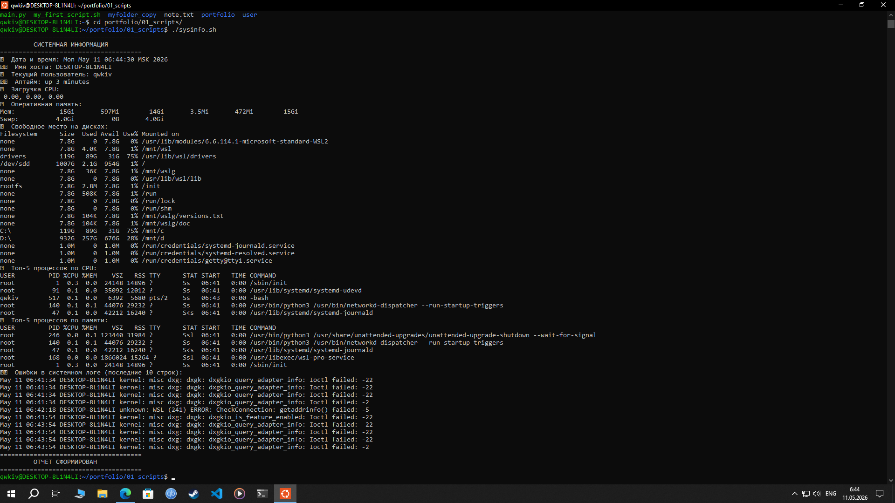
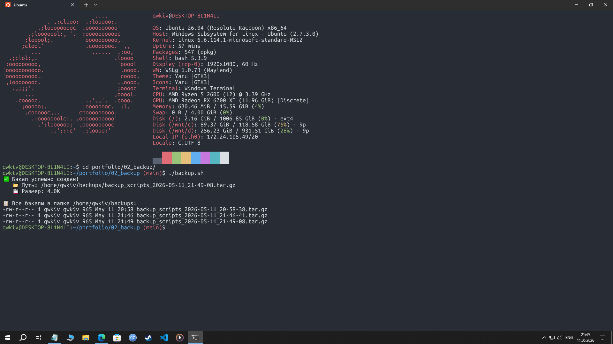

# 🐧 Linux Admin Portfolio

## Обо мне
Начинающий системный администратор. Изучаю Linux с 2026 года. Ищу стажировку или Junior позицию.

## 🛠️ Навыки
- Linux: Ubuntu, Termux
- Bash scripting
- Навигация, права доступа, файловая система
- Мониторинг: `top`, `htop`, `df`, `free`
- Логи: `grep`, `journalctl`

## 📂 Проекты
- Скрипт для просмотра информация о системе (sysinfo.sh)
- Скрипт по резервному копированию папок (backup.sh)

## Особенности скрипта
- Проверяет системные ошибки через `journalctl`
- Сортирует процессы по CPU и памяти
- Работает без прав root (использует доступные логи)

### 1. sysinfo.sh
Скрипт для быстрой диагностики системы. Показывает:
- uptime, загрузку CPU
- память и диски
- топ процессов
- ошибки из логов

## Результат работы

## Резервное копирование папок
- Не знаю что написать

## Результат работы

[Код скрипта](01_scripts/sysinfo.sh)

## 📫 Контакты
- GitHub: https://github.com/kiv101
- Telegram: @kiv01
- Почта: gezun.en@yandex.ru
